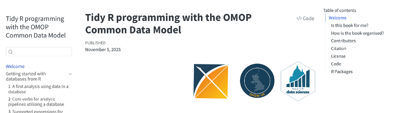
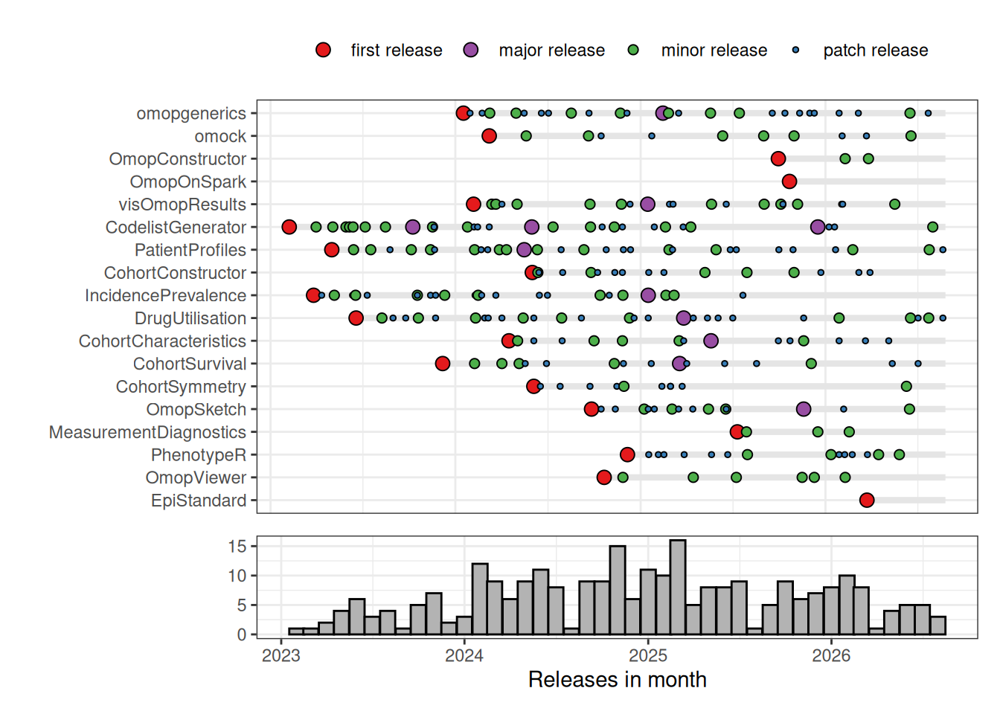
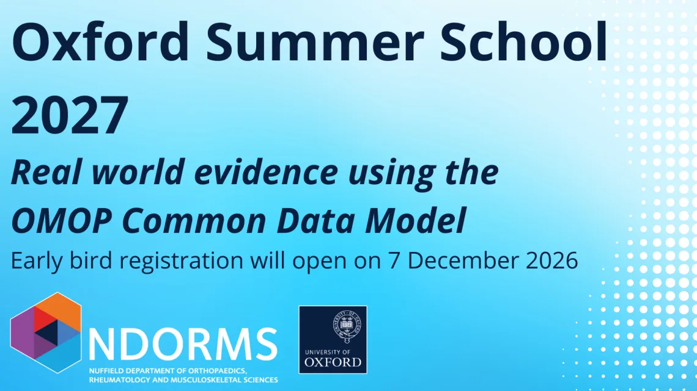
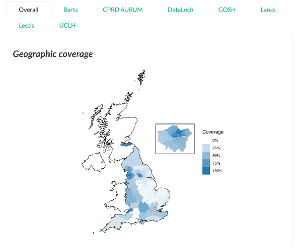
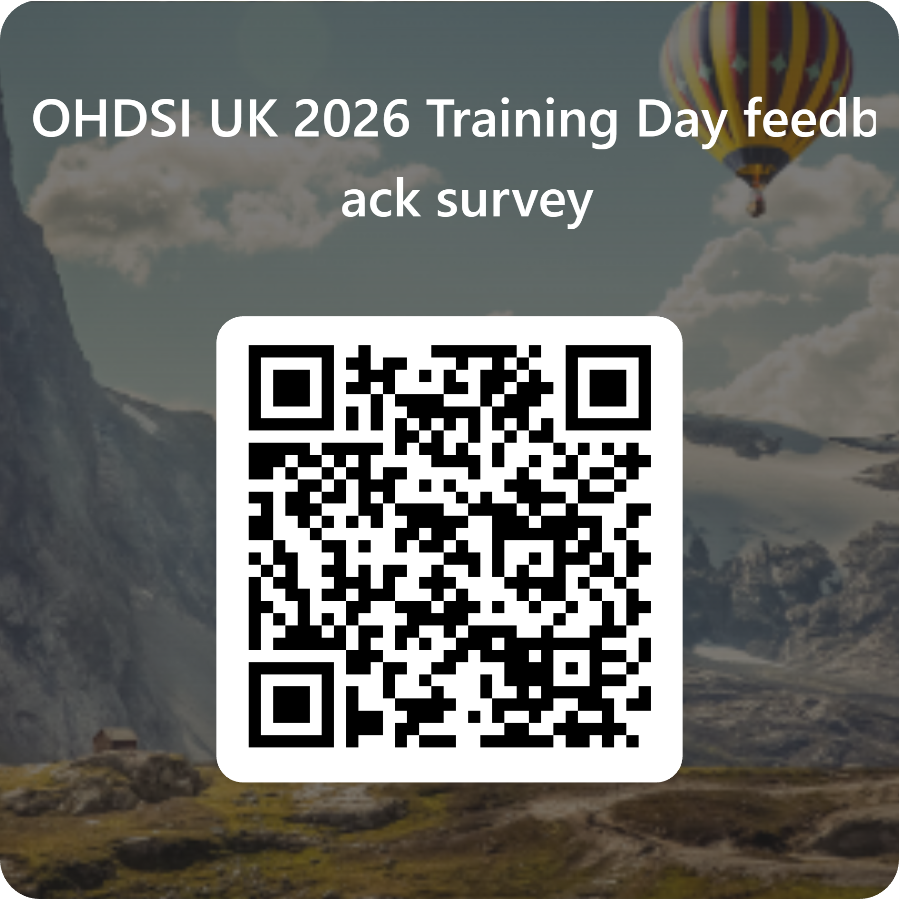

## Book

-   We have a free book [website](https://ohdsi.github.io/Tidy-R-programming-with-OMOP/){.link}

    {width="1393"}

## Software

-   We have a group website [website](https://oxford-pharmacoepi.github.io/Oxinfer/packages/summary.html){.link}

    {width="980"}

## Summer school

-   We have a summer school [website](https://www.ndorms.ox.ac.uk/study/courses/real-world-data-epidemiology){.link}

{fig-align="center" width="711"}

## HERON-UK

-   We co-ordinate HERON-UK [website](https://heron-uk.github.io/heron-uk/){.link}.

## Feedback

-   Please provide feedback [website](https://forms.cloud.microsoft/e/jUsYJnAUhQ){.link}

{fig-align="center" width="400"}

# Thank you
