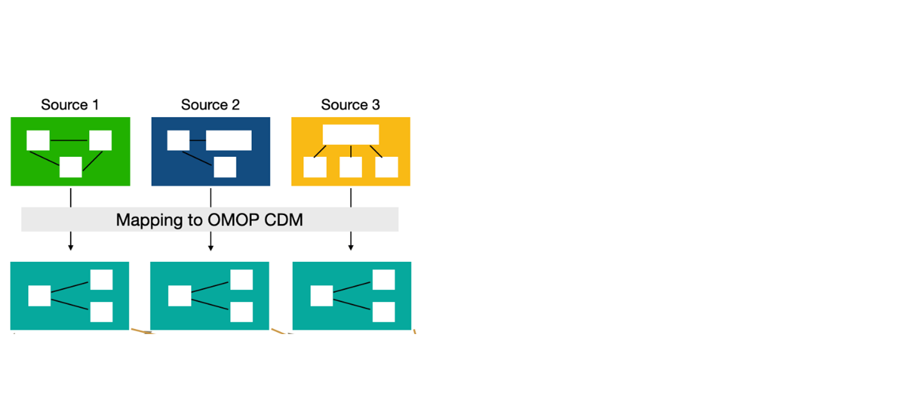
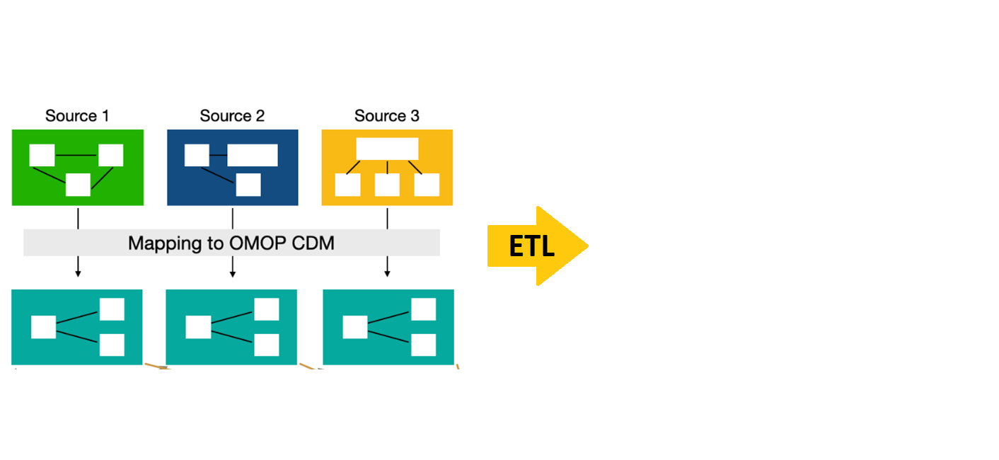
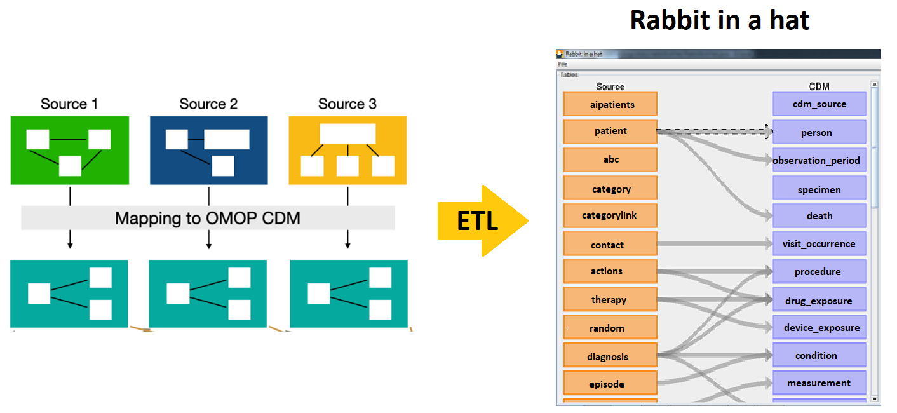
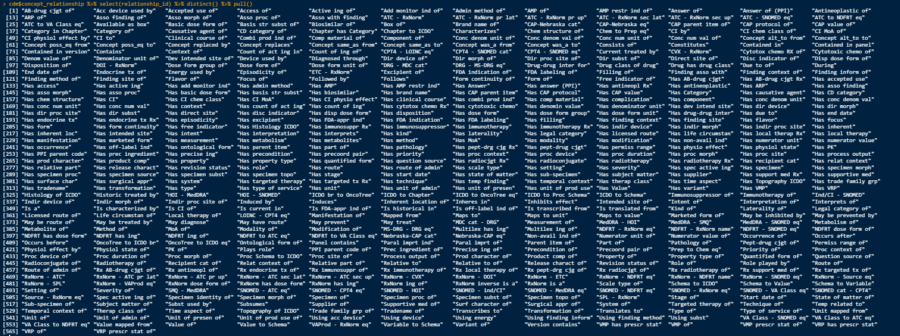
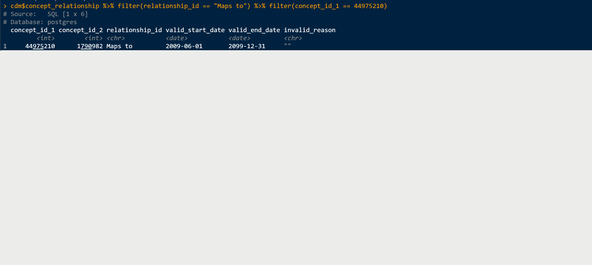
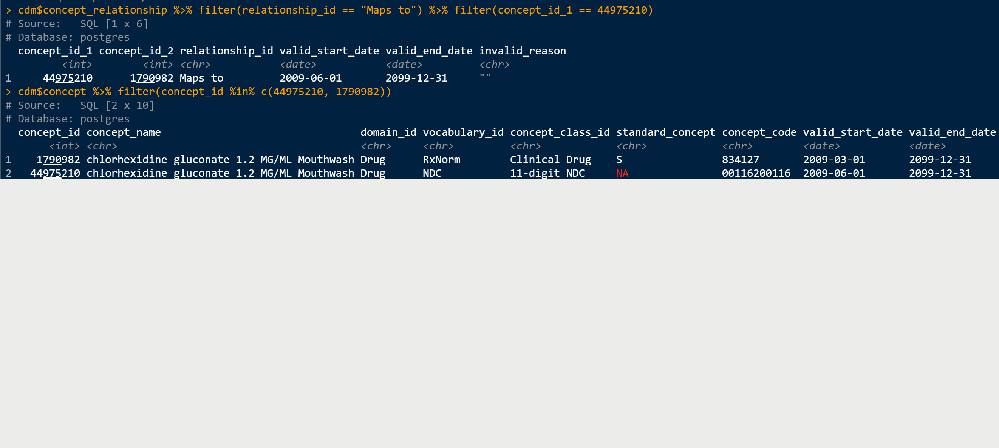
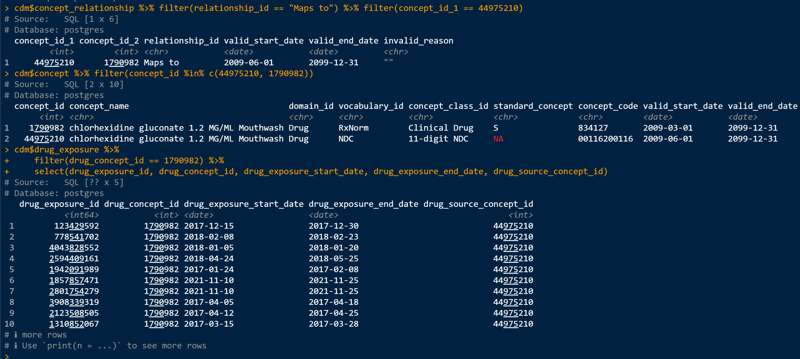
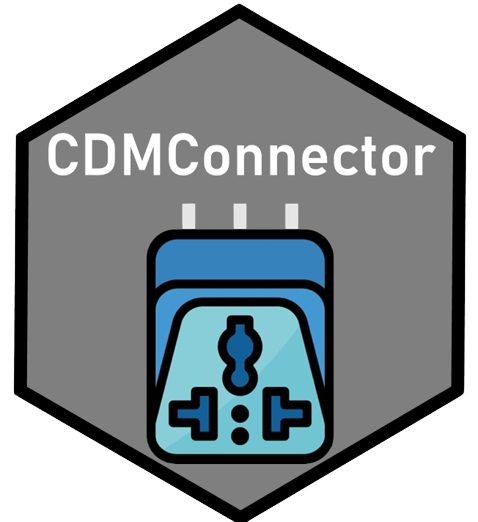

## Introduction: The OMOP Common Data Model

```{r, echo = FALSE}
options(width = 120)
```

-   Every time that someone goes to the doctor and something happens the doctors write it into their records.

-   Each annotation of the doctor is translated into a code, combination of letters and numbers that refers to a condition. There exist several different codding languages: SNOMED, read codes, ICD10, ICD9, RxNorm, ATC, ... It depends on the region, language, type of record and others which one is used. This makes that the same condition or drug can be coded in different ways.

-   A compilation of these records for a group of people is what we call the medical databases. Depending on the origin and purpose of these data there are different groups of databases: electronic health records, claims data, registries... This databases can be structured by several different tables.

-   The Observational Medical Outcomes Partnership (OMOP) Common Data Model (CDM) is an open community data standard, designed to standardise the structure and content of observational data and to enable efficient analyses that can produce reliable evidence.

## Standarisation of the data format


## Mapping a database to the OMOP CDM



## Mapping a database to the OMOP CDM



## Mapping a database to the OMOP CDM



## Standarisation of the vocabularies

From all the vocabularies OMOP CDM uses only a few as `Standard`: SNOMED for conditions, RxNorm for drugs, ...

. . .

The process to obtain an standard code from non standard one is called mapping. We can find the mapping in the concept_relationship table.

. . .

Each one of the records in clinical data tables (condition_occurrence, drug_exposure, measurement, observation, ...) will be coded by two codes:

-   Source concept: particular to each database, it is the `original` code.

-   Standard concept: equivalent code from the standard vocabulary.

## Example of mapping

In concept relationship we can find different information such as:



. . .

In particular, we have the `Maps to` and `Mapped from` relations that can help us to see the mapping between codes.

## Example of mapping



## Example of mapping



## Example of mapping



## More details

. . .

For more details on how the vocabularies work you can check: [Vocabulary course in EHDEN academy](https://academy.ehden.eu/course/view.php?id=4#section-0)

. . .

All details about OMOP CDM and more can be found in: [the book of ohdsi](https://ohdsi.github.io/TheBookOfOhdsi/).

{width="300"}

## Let's start coding

. . .

These are the packages that we will use in this presentation:

. . .

```{r}
library(omock)
library(DBI)
library(CDMConnector)
library(duckdb)
library(here)
library(dplyr)
library(omopgenerics)
library(visOmopResults)
```

. . .

You can click on the specific functions to see `?help` and what package they come from:

```{r, eval=FALSE}
cdmFromCon()
```

## Create a mock reference

You can create a mock database using *omock* from one of the **`r length(availableMockDatasets())`** available synthetic databases:

. . .

```{r, message=TRUE}
availableMockDatasets()
cdm <- mockCdmFromDataset(datasetName = "GiBleed")
cdm
```

## `<cdm_reference>` object

```{r}
class(cdm)
```

. . .

```{r}
cdmName(cdm)
```

. . .

```{r}
cdmVersion(cdm)
```

. . .

```{r, message=TRUE}
cdmSource(cdm)
```

## `<cdm_table>` object

. . .

```{r}
cdm$person
```

. . .

```{r}
class(cdm$person)
```

## Connecting to a database from R (the DBI package)

In general the *OMOP* datasets that we will use won't be locally, and they will on a database.

. . .

Database connections from R can be made using the [DBI](https://dbi.r-dbi.org/) package.

. . .

Connect to postgres:

```{r, eval=FALSE}
library(RPostgres)
db <- dbConnect(
  Postgres(),
  dbname = "...",
  host = "...",
  user = "...",
  password = "..."
)
```

## Connecting to a database from R (the DBI package)

Connect to Sql server:

```{r, eval = FALSE}
library(odbc)
db <- dbConnect(
  odbc(),
  Driver   = "ODBC Driver 18 for SQL Server",
  Server   = "...",
  Database = "...",
  UID      = "...",
  PWD      = "...",
  TrustServerCertificate = "yes",
  Port     = "..."
)
```

. . .

In this [CDMConnector article](https://darwin-eu.github.io/CDMConnector/articles/a04_DBI_connection_examples.html) you can see how to connect to the different supported DBMS.

## Databases organisation

. . .

Databases are organised by `schemas` (blueprint or plan that defines how the data will be organised and structured within the database).

. . .

In general, OMOP databases have two schemas:

-   `cdm schema`: it contains all the tables of the cdm. Usually we only will have reading permission for this schema.

-   `write schema`: it is a place where we can store tables (like cohorts). We need writing permissions to this schema.

## Connect to duckdb database

**duckdb** is a package that allows us to work with local databases.

You should see that in the *Database* folder there are three datasets:

-   **GiBleed**

-   **Delphi**

-   **Synpuf**

## Let's create our first cdm reference

. . .

```{r, message=TRUE}
# connect to the database
dbdir <- here("Databases", "GiBleed.duckdb")
con <- dbConnect(drv = duckdb(dbdir = dbdir))
cdm <- cdmFromCon(con = con, cdmSchema = "main", writeSchema = "results")
cdm
```

## Access to tables of the cdm reference

. . .

```{r}
cdm$person
```

## Read tables in GiBleed

. . .

Once we read a table we can operate with it and for example count the number of rows of person table.

```{r}
cdm$person |>
  count()
```

## Operation with tidyverse

If you are familiarised with [tidyverse](https://www.tidyverse.org/) you can use any of the usual `dplyr` commands in you database tables.

. . .

```{r}
cdm$drug_exposure |>
  group_by(drug_concept_id) |>
  summarise(number_persons = n_distinct(person_id))
```

## How does this work?

```{r}
cdm$drug_exposure |>
  group_by(drug_concept_id) |>
  summarise(number_persons = n_distinct(person_id)) |>
  show_query()
```

## Database name

When we have a cdm object we can check which is the name of that database using:

. . .

```{r}
cdmName(cdm)
```

. . .

In some cases we want to give a database a name that we want, this can be done at the connection stage:

. . .

```{r}
cdm <- cdmFromCon(
  con = con, cdmSchema = "main", writeSchema = "results", cdmName = "GiBleed"
)
```

. . .

```{r}
cdmName(cdm)
```

## Create a new table

```{r}
cdm$my_saved_table <- cdm$condition_occurrence |>
  filter(condition_concept_id == 4112343) |>
  select(person_id, condition_start_date) |>
  compute(name = "my_saved_table")
```

. . .

```{r, error = TRUE}
cdm$my_custom_name <- cdm$person |> 
  compute(name = "not_my_custom_name")
```

## Use a prefix

It is **VERY IMPORTANT** that when we create the cdm object we use a prefix:

```{r, message=TRUE}
cdm <- cdmFromCon(
  con = con, 
  cdmSchema = "main", 
  writeSchema = "results", 
  writePrefix = "my_prefix_"
)
cdm
```

## omock

::::: {style="display: flex; align-items: center; justify-content: space-between;"}
::: {style="flex: 1;"}
👉 [**Packages website**](https://ohdsi.github.io/omock/)\
👉 [**CRAN link**](https://cran.r-project.org/package=omock)\
👉 [**Manual**](https://cran.r-project.org/web/packages/omock/omock.pdf)

📧 <a href="mailto:mike.du@ndorms.ox.ac.uk">mike.du\@ndorms.ox.ac.uk</a>
:::

::: {style="flex: 1; text-align: center;"}

:::
:::::

## omopgenerics

:::: {style="display: flex; align-items: center; justify-content: space-between;"}
::: {style="flex: 1;"}
👉 [**Packages website**](https://darwin-eu.github.io/omopgenerics/)\
👉 [**CRAN link**](https://cran.r-project.org/package=omopgenerics)\
👉 [**Manual**](https://cran.r-project.org/web/packages/omopgenerics/omopgenerics.pdf)

📧 <a href="mailto:marti.catalasabate@ndorms.ox.ac.uk">marti.catalasabate\@ndorms.ox.ac.uk</a>
:::
::::

## visOmopResults

::::: {style="display: flex; align-items: center; justify-content: space-between;"}
::: {style="flex: 1;"}
👉 [**Packages website**](https://darwin-eu.github.io/visOmopResults/)\
👉 [**CRAN link**](https://cran.r-project.org/package=visOmopResults)\
👉 [**Manual**](https://cran.r-project.org/web/packages/visOmopResults/visOmopResults.pdf)

📧 <a href="mailto:nuria.mercadebesora@ndorms.ox.ac.uk">nuria.mercadebesora\@ndorms.ox.ac.uk</a>
:::

::: {style="flex: 1; text-align: center;"}

:::
:::::

## CDMConnector

::::: {style="display: flex; align-items: center; justify-content: space-between;"}
::: {style="flex: 1;"}
👉 [**Packages website**](https://darwin-eu.github.io/CDMConnector/)\
👉 [**CRAN link**](https://cran.r-project.org/package=CDMConnector)\
👉 [**Manual**](https://cran.r-project.org/web/packages/CDMConnector/CDMConnector.pdf)

📧 <a href="mailto:marti.catalasabate@ndorms.ox.ac.uk">marti.catalasabate\@ndorms.ox.ac.uk</a>
:::

::: {style="flex: 1; text-align: center;"}

:::
:::::
